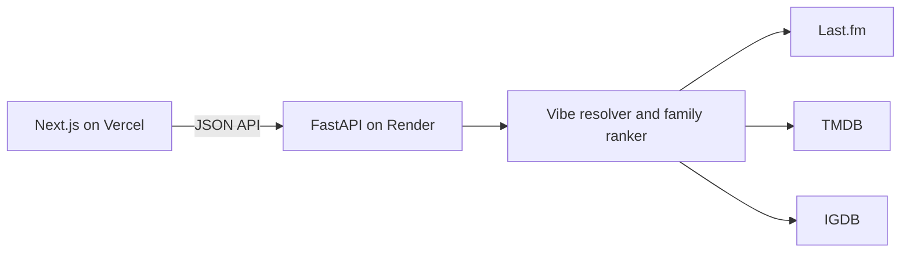

# Cerebro

Cerebro is a Last.fm-first discovery prototype that turns a public listening profile or three selected artists into an eight-dimension vibe and film and game recommendations. It combines Last.fm tags with hand-built genre-family priors, then retrieves and ranks candidates from TMDB and IGDB.

## Status

Version 0.2.0 is a prototype ready for a limited public beta. The 10-profile evaluation passes the Hindi top-five, Punjabi top-ten, Gully Boy, p06 family-share, anchor-rec share, and anchor/language coverage targets. It misses the cross-profile title-repeat target; see [Known limitations](#known-limitations).

## Architecture

## How recommendations work

1. Last.fm supplies an artist's public top tags, listener counts, and play counts; seed mode uses three chosen artists.
2. Tags route artists into genre families, while family priors supply the eight vibe dimensions.
3. The strongest family profiles retrieve film and game candidates, including reviewed title anchors.
4. Candidate scores combine family affinity, five-dimension vibe similarity, catalog quality, and era/mainstream fit.
5. Family slot guarantees and genre-based MMR diversify the final lists; each pick includes a short source-based explanation.

## Local setup

Requirements: Python 3.12 and Node.js 20.

1. Copy `services/api/.env.example` to `services/api/.env` and set provider credentials.
2. From `services/api`, create a virtual environment, install `python -m pip install -e ".[dev]"`, and start `uvicorn app.main:app --reload --port 8000`.
3. Copy `apps/web/.env.local.example` to `apps/web/.env.local`; from `apps/web`, run `npm ci` and `npm run dev`.
4. Open `http://localhost:3000`; the API defaults to `http://127.0.0.1:8000`.

## Environment variables

| Variable | Required | Description |
| --- | --- | --- |
| `ENV` | No | `development` or `production`; defaults to development. |
| `LASTFM_API_KEY` | Yes | Last.fm API key. |
| `TMDB_READ_TOKEN` | For movies | TMDB API read access token. |
| `TWITCH_CLIENT_ID` | For games | Twitch application client ID for IGDB. |
| `TWITCH_CLIENT_SECRET` | For games | Twitch application client secret for IGDB. |
| `CORS_ORIGINS` | Production | Comma-separated exact allowed browser origins. |
| `CORS_ORIGIN_REGEX` | No | Optional allowed-origin pattern; development permits localhost. |
| `CACHE_DIR` | No | Disk cache root; defaults to the development spike cache or `/tmp/cerebro-cache` in production. |
| `NEXT_PUBLIC_API_URL` | Frontend | API base URL; defaults to `http://127.0.0.1:8000`. |

## Deployment

### Render API

1. Connect the repository to Render and create the service from `render.yaml`.
2. Set the Last.fm, TMDB, and Twitch credentials and `CORS_ORIGINS` to the Vercel origin.
3. Confirm `/health` responds with `ok: true`.

### Vercel frontend

1. Import the repository and set the project root to `apps/web`.
2. Set `NEXT_PUBLIC_API_URL` to the deployed Render API URL and deploy.
3. Confirm the deployed Vercel origin is listed in Render's CORS settings.

## Tech stack

- Web: Next.js App Router, React, TypeScript, Tailwind CSS, Framer Motion.
- API: Python 3.12, FastAPI, Pydantic, httpx, Uvicorn.
- Catalogs: Last.fm, TMDB, and IGDB.
- CI: GitHub Actions, Ruff, pytest, ESLint, TypeScript, and Next.js build.

## Known limitations

- `Tony Hawk's Pro Skater 2`, `Hustle & Flow`, `Def Jam: Fight for NY`, and `Need for Speed: Underground 2` recur in the top fives of at least three profiles.
- Some resolved anchors still miss the final list; for p02, Jatt & Juliet ranks first while Udta Punjab is displaced by slot allocation and MMR.
- The recorded cold catalog probe had roughly 1.28 s IGDB p50, above the original 1 s retrieval target; provider and machine latency vary.
- Punjabi anchors resolve, but not every resolved Punjabi title makes the final list; p02 includes Jatt & Juliet at rank 1 while Udta Punjab is displaced.
- Recommendation quality depends on public Last.fm history, catalog metadata, and upstream availability. There are no accounts, database, worker queue, playlist export, or Vibe Card.
- Review each provider's current API terms before public launch.

## Ideas later

- Add richer culturally specific film/game anchors after human review.
- Improve cross-profile candidate diversity using title-level exclusions.
- Revisit family thresholds with broader profile evidence and provider metadata.

## Maintenance

- Backend checks: from `services/api`, run `ruff check app spike tests` and `pytest`.
- Run cached vibe profiles: `python -m spike.run_resolver`.
- Run the live catalog ranking evaluation: `python -m spike.run_ranking --profiles spike/fixtures/profiles.json`.
- Diagnose a title: `python -m spike.explain_pick --profile p03 --title "Gully Boy"`.
- Review family retrieval intents and anchors in `services/api/app/services/catalog/family_profiles.py`.
- Add anchors to the appropriate `FILM_PROFILES` or `GAME_PROFILES` entry, then run `python -m spike.verify_anchors` and the ranking harness.
- Frontend checks: from `apps/web`, run `npm run lint`, `npm run typecheck`, and `npm run build`.

## Attribution

- Data provided by Last.fm
- This product uses the TMDB API but is not endorsed or certified by TMDB.
- IGDB data provided by Twitch Interactive, Inc.
