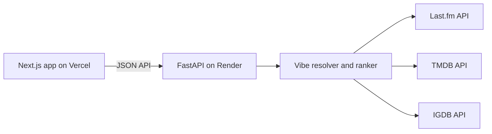

# Cerebro

Cerebro is a Last.fm-first listening discovery prototype that turns a public listening profile—or three selected artists—into an eight-dimension vibe, a listening archetype, and film and game recommendations. It uses Last.fm tags and genre-family priors to describe music taste, then retrieves and ranks candidates from TMDB and IGDB.

## Architecture



## Local setup

Requirements: Python 3.12 and Node.js 20.

1. Copy `services/api/.env.example` to `services/api/.env` and fill in provider credentials. `CACHE_DIR` may be left blank for the development default.
2. From `services/api`, install and start the backend:

   ```sh
   python -m venv .venv
   # Activate .venv, then:
   python -m pip install -e ".[dev]"
   uvicorn app.main:app --reload --port 8000
   ```

3. In another terminal, copy `apps/web/.env.local.example` to `apps/web/.env.local`, then run:

   ```sh
   cd apps/web
   npm ci
   npm run dev
   ```

The web app defaults to `http://127.0.0.1:8000`; local CORS permits localhost origins in development.

## Environment variables

| Variable | Required | Description |
| --- | --- | --- |
| `ENV` | No | `development` or `production`; defaults to `development`. |
| `LASTFM_API_KEY` | Yes | Last.fm API key. |
| `TMDB_READ_TOKEN` | Yes for movies | TMDB API read access token. |
| `TWITCH_CLIENT_ID` | Yes for games | Twitch application client ID used for IGDB. |
| `TWITCH_CLIENT_SECRET` | Yes for games | Twitch application client secret used for IGDB. |
| `CORS_ORIGINS` | Production | Comma-separated exact browser origins. |
| `CORS_ORIGIN_REGEX` | No | Optional additional allowed origin pattern; development retains localhost access. |
| `CACHE_DIR` | No | Cache root; defaults to the existing spike cache in development and `/tmp/cerebro-cache` in production. Unwritable storage falls back to memory. |
| `NEXT_PUBLIC_API_URL` | Frontend | API base URL; defaults to `http://127.0.0.1:8000`. |

## Deployment

### Render API

1. Connect the repository to Render and create the service from `render.yaml`.
2. Add the Last.fm, TMDB, and Twitch credentials in the service environment. Set `CORS_ORIGINS` to the exact Vercel production origin (and any intended preview origins).
3. Confirm `/health` reports `ok: true`; `degraded` indicates missing provider configuration.

### Vercel web app

1. Import the repository into Vercel and set the project root directory to `apps/web`.
2. Set `NEXT_PUBLIC_API_URL` to the public Render API URL, deploy, and verify that the deployed origin is included in Render's `CORS_ORIGINS`.

## Tech stack

- Frontend: Next.js App Router, React, TypeScript, Tailwind CSS, Framer Motion.
- Backend: Python 3.12, FastAPI, Pydantic, httpx, Uvicorn.
- Sources: Last.fm, TMDB, and IGDB.
- CI: GitHub Actions with Ruff, pytest, ESLint, TypeScript, and a Next.js production build.

## Limitations

- Last.fm profiles must be public and have enough listening history; seed mode accepts exactly three distinct artists.
- Rate limits and result caching are process-local; cache files are optional and stored under `CACHE_DIR`.
- Catalog results and tag coverage depend on upstream availability and the metadata returned for each profile.
- The prototype has no user accounts, database, background workers, playlist export, or Vibe Card.
- Review each provider's current API terms before public launch.

## Attribution

- Data provided by Last.fm
- This product uses the TMDB API but is not endorsed or certified by TMDB.
- IGDB data provided by Twitch Interactive, Inc.
